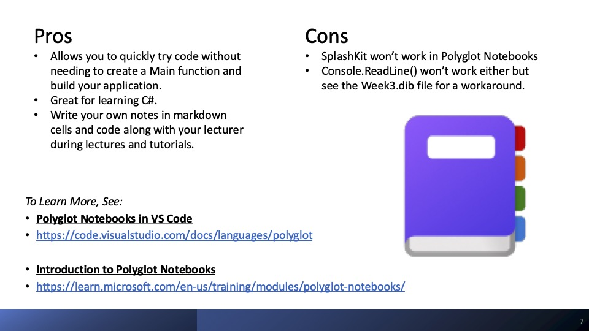

  
  

    <h1 style="margin: 0;">SIT771:</h1>
    <h1 style="margin: 0;">Object-Oriented Development</h1>
  

This repository was created to help other Deakin students to learn object-oriented development. It includes all of the examples from the lecture notes for _SIT771: Object-Oriented Development_ prepared as [Polyglot Notebooks](https://code.visualstudio.com/docs/languages/polyglot). When I was studying this class I found it really helpful to experiment with `C# code` without the need to continously go back to the command line to run it. It was also very useful to have open during the lectures to try out new things to see how they worked. This gave me the confidence to ask questions in class if things didn't work as I expected and to confidently give answers to questions asked in class (because I had quickly tried out the code, run it, and now knew the answer).

If you are familiar with how repositories work feel free to clone this repository to your computer. If you don't know how to do that, then just follow the instructions for Installing and Using Polyglot Notebooks that I've given below and then follow each of these links to find the Polyglot Notebook for each week of the course and then click on the **Download raw file** button in GitHub.

* [Week 1](notebooks/Week1.dib)
* [Week 2](notebooks/Week2.dib)
* [Week 3](notebooks/Week3.dib)
* [Week 4](notebooks/Week4.dib)
* [Week 5](notebooks/Week5.dib)
* [Week 6](notebooks/Week6.dib)
* [Week 7](notebooks/Week7.dib)

If you are particularly adventurous, you might even want to try creating your _UML Diagrams_ in a Polyglot Notebook using [Mermaid](https://mermaid.js.org/intro/getting-started.html).

Using Polyglot Notebooks is very similar to using [Jupyter Notebooks](https://jupyter.org/). You will get the option of using an online hosted Jupyter Notebook service later in the course through [Google Colab](https://colab.google/).

This is a really good class and you can learn a lot. Good luck with everything and I wish you the all the best.

Kind Regards.

Rob.
(SIT771 student T3/2024)

---

# Installing and Using Polyglot Notebooks
[Installing-and-Using-Polyglot-Notebooks.pdf](pdfs/Installing-and-Using-Polyglot-Notebooks.pdf) 

